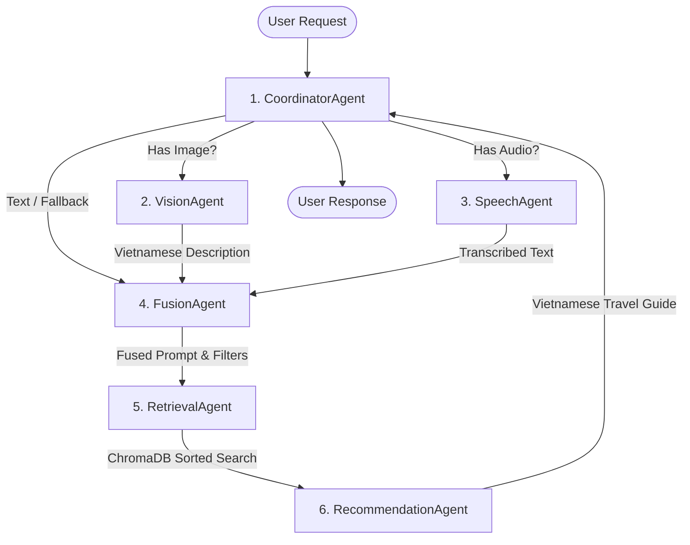

# Multi-Agent Coordination System (6-Agent Architecture)

TravelChatBot utilizes a modular **6-Agent Coordination Pipeline** to seamlessly integrate multimodal inputs (text, images, speech) with semantic vector search (RAG) and generate highly personalized, context-aware travel recommendation guides.

---

## 🗺️ Architectural Workflow

The system is coordinated by a central orchestrator which guides the query through a sequence of processing, search, and generation steps.

---

## 🤖 Detailed Agent Breakdown

### 1. Coordinator Agent (`ai_module.models.chatbot.Chatbot`)
The central orchestrator of the entire system.
*   **Workflow Coordination**: Resolves input modalities (text, audio, image) and routes them to helper agents.
*   **Context Syncing**: Restores historical conversation turns from SQLAlchemy database schemas before executing the pipeline.
*   **Interface Layer**: Provides a clean entry-point API (`get_response(...)`) used by administrative command CLI tools and FastAPI routes alike.

### 2. Vision Agent (`ai_module.models.agents.VisionAgent`)
Converts visual inputs into rich, descriptive Vietnamese text.
*   **API Usage**: Utilizes the GenAI client's vision model.
*   **Role**: Translates photos of dishes, activities, landmarks, or scenery into detailed, semantic travel context.

### 3. Speech Agent (`ai_module.models.agents.SpeechAgent`)
Handles voice queries.
*   **API Usage**: Utilizes audio model transcription.
*   **Role**: Transcribes spoken Vietnamese audio files into standard unicode queries, supporting voice-based travel assistants.

### 4. Fusion Agent (`ai_module.models.agents.FusionAgent`)
Blends text queries, vision descriptions, and voice transcriptions into a singular context-rich search prompt.
*   **Role**: Resolves conflicting queries, eliminates noise, and builds a comprehensive Vietnamese query that encapsulates all user intents.

### 5. Retrieval Agent (`ai_module.models.agents.RetrievalAgent`)
Retrieves precise, contextually relevant spots from ChromaDB.
*   **Semantic Matching**: Queries vector collections using cosine/L2 embeddings.
*   **Metadata Filtering**: Resolves targeted destinations.
*   **Post-Retrieval Sorting**: Applies custom, programmatic search sorting on keys such as `time`, `evaluate_mean`, or `evaluate_count`.

### 6. Recommendation Agent (`ai_module.models.agents.RecommendationAgent`)
The final content author.
*   **Generative AI**: Integrates the fused query with the fetched travel guide contexts.
*   **Output Styling**: Writes an elegant, editorial-style Vietnamese travel guide.
*   **Absolute Image Resolution**: Safely parses and injects correct absolute file paths for local travel guide images so they render flawlessly as inline markdown images (``).