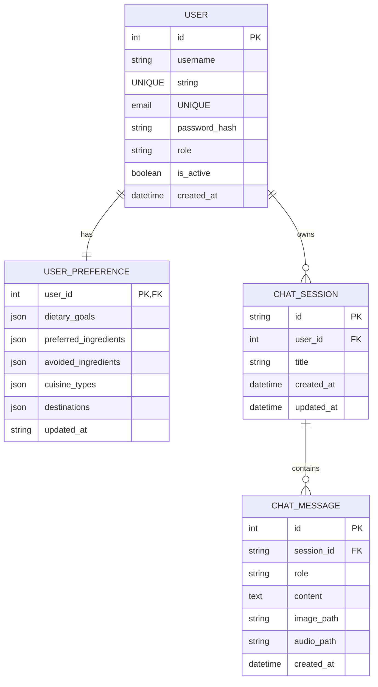

# Relational User Database Layer (SQLAlchemy & SQLite)

TravelChatBot utilizes a relational **SQLite database** (`backend/database.db`) managed via **SQLAlchemy ORM** to coordinate user authentication, personalized preferences, and persistent chat logs.

---

## 📐 Relational Database Schema

The database model layer is structured around the `User` profile, using cascading relationships to ensure clean data integrity:

---

## 🔒 Security & Password Hashing

User passwords are never stored in plain-text. TravelChatBot implements industry-standard **bcrypt password hashing** at the database model level:

*   **Hashing algorithm**: bcrypt.
*   **Encapsulated Logic**: The `User` model defines the properties:
    *   `set_password(password)`: Generates a secure salt and hashes the plain-text password, storing the string result in `password_hash`.
    *   `check_password(password)`: Decodes and verifies input against the stored secure hash, rejecting empty values.

---

## 🧹 Cascading Relationship Deletions

To prevent orphan data records, cascading delete configurations are established at the database layer:

*   **User Cascade**: Deleting a `User` profile automatically triggers the deletion of their related `UserPreference` records and all associated `ChatSession` history logs.
*   **ChatSession Cascade**: Deleting a `ChatSession` automatically deletes all its historical `ChatMessage` logs, including stored absolute file paths for user-uploaded media.
